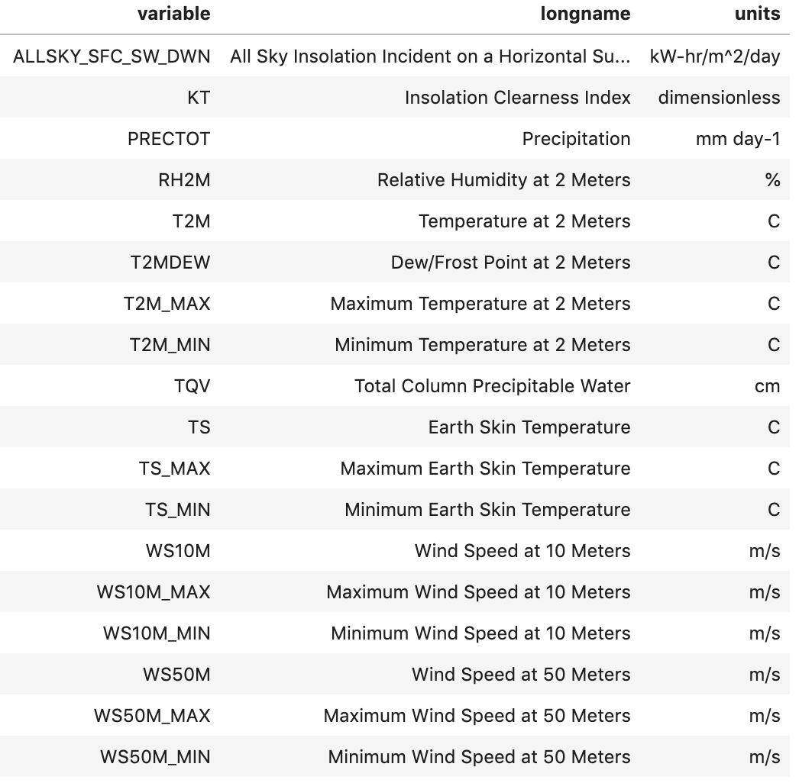
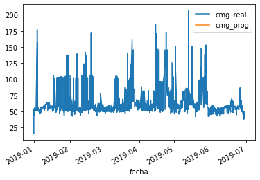

# Desafío Spike Septiembre 2020 - Predicción de desviación de precios en el sistema eléctrico chileno


Algunos puntos importantes a considerar:
- Este desafío no te debiera tomar más de 5 horas de tu tiempo (y ojalá menos!). Por lo mismo, no esperamos respuestas muy pulidas ni perfectas.
- Las preguntas irán aumentando en dificultad, por lo que intenta responder hasta donde puedas. Si por algún motivo hay alguna parte que no lograste completar, no hay problema, puedes tratar de completar lo que sigue.
- Tendrás hasta el jueves 1 de octubre a las 23:59 para enviar tus respuestas al desafío.
- Solo se aceptarán Jupyter notebook (recomendado), R Markdown o R Notebook como formatos de entrega y solamente python o R. La idea es que sea fácil para nosotros correr lo que ustedes escribieron (y que sea reproducible).
- Habilitamos un canal en Gitter para que todos puedan colaborar entre sí. Ingresa en https://gitter.im/desafioSpike/energia (se requiere cuenta github o gitlab).
- Entrega tu desafío acá: https://forms.gle/rqgMUFMQ5f4Ja1zk9
- Finalmente, ¡lee bien las instrucciones! 


## Motivación

**Nota**: 
Este segmento de motivación es para entregar contexto del problema y mostrar por qué es relevante. No es necesario que entiendan todo; el resto del desafío los irá guiando en las cosas específicas que deben hacer. En otras palabras: traten de leer esto rápido y luego concéntrense en las preguntas e instrucciones del desafío.

El Sistema Electrico Nacional reúne a distintas empresas que en su conjunto se encargan de la generación, transmisión, distribución y consumo de energía en Chile. Para lograr esto, existen instalaciones que cumplen distintas funciones en el sistema, incluyendo:

* Centrales eléctricas generadoras.
* Líneas de transmisión troncal.
* Líneas de subtransmisión y adicionales.
* Subestaciones eléctricas.
* Barras de consumo.

El Coordinador Eléctrico Nacional es el organismo encargado de coordinar la operación de las instalaciones del Sistema Eléctrico Nacional, con el objetivo de garantizar la operación más económica del sistema, preservar su seguridad y garantizar el acceso abierto a los sistemas de transimisón. Dentro de sus funciones debe programar la generación de electricidad, con el objetivo de minimizar el costo marginal.


[Más información del Sistema Eléctrico Nacional aquí](https://sic.coordinador.cl/novedades/como-funciona-sistema-interconectado-central/)


## Desafío

En este desafío estimaremos la desviación de precios del sistema eléctrico chileno. Específicamente, estimaremos la desviación de los costos marginales en distintos nodos del sistema,  entendiendo qué variables son las que más afectan su comportamiento y cómo esto podría ser útil para la eficiencia del sistema. Para ello, hemos construido un dataset usando datos públicos y reales del sistema eléctrico de Chile.

Algunas definiciones importantes: 

**Sistema Eléctrico**: Conjunto de instalaciones de centrales eléctricas generadoras, líneas de transporte, subestaciones eléctricas, líneas de distribución, interconectadas entre sí, que permite generar, transportar y distribuir energía eléctrica. 

**Subestación**: Conjunto de instalaciones eléctricas (transformadores, aisladores, interruptores, etc) y de infraestructura (terreno, edificio, etc), que sirven para transferir energía, transformar voltajes, recibir y entregar energía y suministrar electricidad a consumos. 

**Barra Principal**: Es un tramo de conductores aislados, donde convergen líneas de transmisión, alimentación a bancos de autotransformadores y transformadores de poder que retiran o inyectan energía a la barra, permitiendo el traspaso de flujos de potencias entre las líneas.
Si tienes dudas, puedes consultar el glosario del `SIC` (Sistema Interconectado Central) en https://sic.coordinador.cl/wp-content/uploads/2013/12/MP_Glosario_CDEC-SIC.pdf


### Bases de datos

Vamos a trabajar con diversos datasets, que se detallan a continuación. Si por alguna razón tienes problemas de RAM para cargar las bases, toma un subconjunto aleatorio de las subestaciones y continúa con el desafío.

Retiros de energía [MWh] a nivel de barra y hora. **demanda_real.csv** [descargar](https://storage.googleapis.com/sistema_electrico_chile/demanda_real.csv) 

Costos marginales reales [USD/MWh] a nivel de barra y hora (cada fila es una barra y día-hora). **costo_marginal_real.csv** [descargar](https://storage.googleapis.com/sistema_electrico_chile/costo_marginal_real.csv) 

Costos marginales programados [USD/MWh] (por el SIC) a nivel de barra y hora (cada fila es una barra y día-hora). **costo_marginal_programado.csv** [descargar](https://storage.googleapis.com/sistema_electrico_chile/costo_marginal_programado.csv) 

Base para entrenar modelos. **base_para_predicción.csv** [descargar](https://storage.googleapis.com/sistema_electrico_chile/base_para_prediccion.csv) 


Nivel de observación: día-hora y subestación (cada fila es una subestación y día-hora).

* nemotecnico_se: código subestación eléctrica
  
* fecha, hora: año, mes, día y hora.
  
* gen_eolica_total_mwh: generación eólica total por subestación en MWh
  
* gen_geotermica_total_mwh: generación geotérmica total por subestación en MWh
  
* gen_hidraulica_total_mwh: generación hidráulica total por subestación en MWh
  
* gen_solar_total_mwh: generación solar total por subestación en MWh
  
* gen_termica_total_mwh: generación térmica total por subestación en MWh
  
* cmg_real: costo marginal real [USD/MWh] promedio por subestación
  
* cmg_prog: costo marginal programado [USD/MWh] promedio por subestación
  
* cmg_desv: desviación absoluta promedio entre costo marginal programado y costo marginal real
  
* cmg_desv_pct: desviación porcentual promedio del costo marginal real con respecto al costo marginal programado
  
* n_barras: número de barras conectadas aguas abajo de una subestación
  
* demanda_mwh: retiros de energía [MWh] efectuados por compañías coordinadas bajo el sistema eléctrico
  
* cap_inst_mw: capacidad de generación máxima instalada por subestación [MW]

  
Datos de clima a nivel de subestación y día (cada fila es una subestación y un día). **datos_clima.csv** [descargar](https://storage.googleapis.com/sistema_electrico_chile/datos_clima.csv)





### Preguntas


#### 1. Costos marginales

+ Carga el archivo `costo_marginal_real.csv`Estos son los costos marginales reales observados.
+ Carga el archivo `costo_marginal_programado.csv`. Estos son los costos marginales previstos por el sistema. 
+ Haz un merge del costos marginal real con el costo marginal programado a nivel de barra (*Ayuda: la columna de join no se llama igual en ambas bases! Los datos venían así del SIC *). Llama a esta nueva base `costo_marginal` 
+ Realiza un análisis exploratorio de la base resultante. ¿Qué puedes decir de las distintas variables? ¿Cómo distribuyen? En particular analiza las barras (`barra_mnemotecnico`). ¿Para cuántas barras se programa el costo? ¿Qué porcentaje es del total de barras que puedes observar en la base?

#### 2. Construcción de variables

Construye las siguientes variables para la base que creaste en el punto anterior:

* `desviación`: la diferencia entre el costo real y el costo programado
  
* `desviación_pct`: la misma desviación, pero en porcentaje
  
* `desviacion_cat`: una variable categórica que vale `1`si la `desviación_pct `absoluta
  es mayor a 15% (esto es, si es menor a -15% o mayor a 15%)
  

Describe la variable `desviacion_cat` . Qué puedes observar? Cambia a través del tiempo?

#### 3. Visualización de datos

Crea la siguiente función: 
``` def time_plot_costo_barra(codigo_barra, fecha_inicial, fecha_final): ```

que tome como input el código de una barra y haga un `plot` en el tiempo del costo marginal real y del costo marginal programado. El eje `x` debe ser el tiempo. `fecha_inicial` y `fecha_final`_ dan los límites de este `plot`. Úsa esta función para plotear algunas barras. Acá hay un ejemplo:



Qué puedes concluir de estos plots?

Además, identifica la barra que tiene `cmg_real= 0` durante todos los días y elimínala de tu dataset.

#### 4. Base para los modelos

Carga la base `base_para_predicción.csv`. Esta será la base principal para las siguientes preguntas.

+ En rasgos generales, ¿Qué puedes decir de los datos? (dimensiones, tipo de datos, variables categóricas, variables numéricas, fechas).
+ A partir de la variable fecha, crea nuevas variables para el año, mes, semana del año, dia del calendario, dia de la semana y una variable que indique si el dia corresponde a un día de semana o fin de semana. Estas features/variables te servirán para entrenar el modelo.
+ Implementa una función que para una subestación y una variable, grafique múltiples series de tiempo diarias correspondientes a una lista de fechas. Para esto, la función debe recibir como argumentos: código de una subestación, una variable (serie numérica), y una lista de fechas (año-mes-día). Por ejemplo: para la subestación SE005T002 y la variable gen_solar_total_mwh, la función debe graficar los perfiles diarios de generación solar por hora para las fechas '2019-01-10', '2019-02-10' y '2019-03-10'.
+ Grafica la curva de generación solar, por hora, en la subestación SE005T002 para las fechas del 10, 11, 12, 13 y 14 de enero de 2019. Haz lo mismo para la subestación SE127T005. Que podrías decir, en términos generales, sobre la generación solar y las dos subestaciones mencionadas, basados en estos dos gráficos?
+ Grafica la curva de generación térmica, por hora, en la subestación SE020G213 para los días 14, 15, 16 y 17 de mayo de 2019. Haz lo mismo para la subestación SE106G216. Que podrías decir, en términos generales, sobre la generación térmica en esta subestación con respecto a este gráfico?


#### 5. Predicción de desviaciones del costo marginal: modelo 1

+ Crea una variable target que sea igual a cero cuando la variable cmg_desv_pct esté en el rango [-15,15], e igual uno para cualquier otro caso. Hint: recuerda que existen valores infinitos.
+ Ahora crea los siguientes features: 
  + en_total_mwh: suma de las cinco series de generación.
  + lags y estadísticas acumuladas (por ejemplo: promedio, varianza) de las variables que consideres relevantes.
+ Entrena un modelo que prediga si existirá una desviación en la hora siguiente. Adecúa la variable target para hacer esto posible.
+ ¿Cómo le va a tu modelo? ¿En qué métricas te basas y por qué?
+ ¿Cuales son las variables más importantes que considera este modelo?

#### 6. Predicción de desviaciones del costo marginal: modelo 2

Ahora imagina que te dicen que, en producción, te enviarán datos actualizados del sistema cada 12 horas.
¿Cuál debiese ser tu target a predecir en ese caso? Explica.

Entrena un nuevo modelo con ese target y evalúalo con una métrica que te parezca importante.
¿Cómo se compara con los resultados del modelo 1?

#### 7. Merge con datos de clima: modelo 3

Haz un merge con los datos de clima (`datos_clima.csv`) y entrena nuevamente tu modelo 2.

+ ¿Cómo manejas el data leakage en este caso?
+ ¿Cuánto mejora la capacidad predictiva del modelo? ¿Cuáles variables son las más importantes?

#### 8. Reflexión

+ ¿Por qué sería bueno utilizar un modelo como este para anticiparse a desvíos de precios de la energía?
+ ¿Qué casos de uso te imaginas podrían beneficiarse teniendo acceso a un modelo como este?

